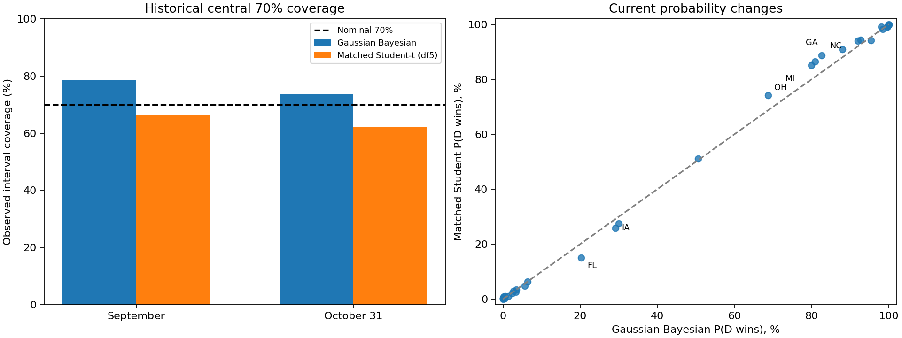

# Matched Student-t review

[Complete supporting results](../../results/experiments/matched_student_review/) · [Run settings](../../results/experiments/matched_student_review/run.json)

Latest execution: `20260921T185940.592697Z`. Forecast cutoff: **frozen historical/reference inputs**.

Margins are Democratic minus Republican percentage points. Experiments do not replace the active model or automatically select blend weights.

## Historical comparison

| Horizon           | Model                   |   Races |   Correct calls |   Margin MAE (pp) |   Brier score |
|:------------------|:------------------------|--------:|----------------:|------------------:|--------------:|
| Matched September | Gaussian Bayesian       |     140 |         128.000 |             6.307 |         0.055 |
| Matched September | Matched Student-t (df5) |     140 |         129.000 |             6.344 |         0.055 |
| October 31        | Gaussian Bayesian       |     140 |         132.000 |             5.206 |         0.050 |
| October 31        | Matched Student-t (df5) |     140 |         132.000 |             5.224 |         0.049 |

## Current chamber forecast

| Horizon           | Model                   |   D seats (mean winners) |   R seats (mean winners) |   Expected D seats |   D control % |   D seats: 70% low |   D seats: 70% high |
|:------------------|:------------------------|-------------------------:|-------------------------:|-------------------:|--------------:|-------------------:|--------------------:|
| Matched September | Gaussian Bayesian       |                       51 |                       49 |             50.320 |        45.520 |                 49 |                  52 |
| Matched September | Matched Student-t (df5) |                       51 |                       49 |             50.476 |        50.028 |                 49 |                  52 |

For all scenarios, per-state tables, sampler diagnostics and exact provenance, see the [complete result bundle](../../results/experiments/matched_student_review/).
