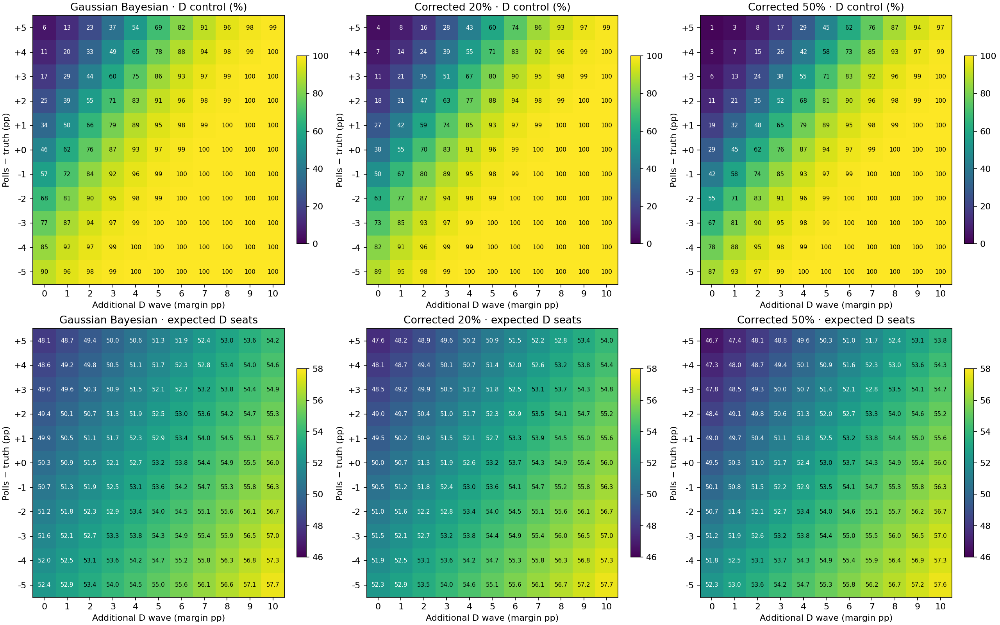

Archived execution date (UTC): **2026-09-21**. Run: `20260921T185909.972436Z`. Same-day reruns replace this copy; other dates are retained.

# Wave and polling-error scenarios

Complete supporting results · [Run settings](supporting_run.json)

Latest execution: `20260921T185909.972436Z`. Forecast cutoff: **2026-09-21**.

Margins are Democratic minus Republican percentage points. Experiments do not replace the active model or automatically select blend weights.

## Baseline before scenario stress

| Model             |   D seats (mean winners) |   R seats (mean winners) |   Expected D seats |   D control % |   D seats: 70% low |   D seats: 70% high |
|:------------------|-------------------------:|-------------------------:|-------------------:|--------------:|-------------------:|--------------------:|
| Gaussian Bayesian |                       51 |                       49 |             50.320 |        45.520 |                 49 |                  52 |
| Corrected 20%     |                       51 |                       49 |             50.031 |        38.290 |                 48 |                  52 |
| Corrected 50%     |                       51 |                       49 |             49.539 |        28.950 |                 48 |                  51 |

For all scenarios, per-state tables, sampler diagnostics and exact provenance, see the complete result bundle.
