Archived execution date (UTC): **2026-09-25**. Run: `20260925T165700.979963Z`. Same-day reruns replace this copy; other dates are retained.

# 2026 Senate forecast — 2026-09-25

All outputs · [HTML report](report.html) · Supporting tables

## At a glance

- **D/Independent control: 60.2%** under the reference Gaussian model.
- **Expected D/Independent seats: 50.9**; central 70% range: **49–52**.
- Predicted winners by mean margin: **51 D/IND / 49 R**.
- Trained through **2024**. Live evidence updates predictions; trained parameters are fixed.

Margins are D/Independent minus Republican percentage points. Positive margins favor the D/Independent side. D control requires 51 seats; R control includes a 50–50 chamber under the retained vice-presidential tie-break assumption.

## Poll coverage and candidate affiliations

[All-state polling audit](poll_audit.md). Independents retain their IND affiliation. For multiple D/IND candidates, the strongest individual candidate is used, never their summed votes. Independent chamber alignment is an explicit modeling assumption.

## Data freshness

| Source         | Status                         | Last successful check            |
|:---------------|:-------------------------------|:---------------------------------|
| polls          | Recent successful check reused | 2026-09-25T16:00:45.044540+00:00 |
| fred           | Recent successful check reused | 2026-09-25T16:00:45.904634+00:00 |
| michigan       | Recent successful check reused | 2026-09-25T16:00:46.960671+00:00 |
| ucsb           | Recent successful check reused | 2026-09-25T16:00:42.728027+00:00 |
| french         | Recent successful check reused | 2026-09-25T16:00:44.163764+00:00 |
| cboe           | Recent successful check reused | 2026-09-25T16:00:45.897772+00:00 |
| gpr            | Recent successful check reused | 2026-09-25T16:00:47.829208+00:00 |
| epu            | Recent successful check reused | 2026-09-25T16:00:48.489066+00:00 |
| infectious_emv | Recent successful check reused | 2026-09-25T16:00:47.810410+00:00 |

Political context is reviewed through **2026-09-17**. It is carried forward as an explicit assumption.

The forecast cutoff does not mean every source has observations through that date. Missing evidence is not replaced with a zero.

## Chamber forecast across models

| Model                               |   Expected D seats |   D control % |   R control % |   D seats: 70% low |   D seats: 70% high |
|:------------------------------------|-------------------:|--------------:|--------------:|-------------------:|--------------------:|
| Gaussian Bayesian                   |              50.89 |         60.17 |         39.83 |                 49 |                  52 |
| Gaussian: 10% shift toward baseline |              50.75 |         56.30 |         43.70 |                 49 |                  52 |
| Gaussian: 20% shift toward baseline |              50.61 |         52.62 |         47.38 |                 49 |                  52 |
| Gaussian: 40% shift toward baseline |              50.30 |         45.35 |         54.65 |                 49 |                  52 |
| Gaussian: 50% shift toward baseline |              50.14 |         42.08 |         57.92 |                 48 |                  52 |
| Empirical baseline                  |              49.48 |         32.37 |         67.63 |                 47 |                  52 |
| Older Gaussian                      |              51.82 |         75.12 |         24.88 |                 50 |                  54 |
| Student-t research helper           |              51.80 |         76.50 |         23.50 |                 50 |                  54 |
| Matched Student-t (df5)             |              51.01 |         63.50 |         36.50 |                 50 |                  52 |
| Four-model mixture                  |              51.38 |         68.82 |         31.18 |                 50 |                  53 |
| Mixture: 5% shift toward baseline   |              51.29 |         66.92 |         33.08 |                 50 |                  53 |
| Mixture: 10% shift toward baseline  |              51.20 |         64.95 |         35.05 |                 49 |                  53 |
| Mixture: 20% shift toward baseline  |              51.01 |         60.88 |         39.12 |                 49 |                  53 |
| Mixture: 30% shift toward baseline  |              50.83 |         56.60 |         43.40 |                 49 |                  53 |
| Mixture: 40% shift toward baseline  |              50.63 |         52.20 |         47.80 |                 49 |                  53 |
| Mixture: 50% shift toward baseline  |              50.43 |         47.76 |         52.24 |                 49 |                  52 |

All forecasts shown here use polling evidence when available. The empirical baseline uses poll averages and historical polling-error patterns. A 20% shift moves the predicted margin one-fifth of the way toward that baseline while retaining the original model’s uncertainty distribution. It does not mean the other models omit polls or need correction. Mixtures and mean shifts are comparisons, not automatically selected replacements for the reference model.

## State forecasts — reference model

| Contest      |   D/IND−R margin |   D/IND win % |   95% low |   95% high |
|:-------------|-----------------:|--------------:|----------:|-----------:|
| AK           |            -2.46 |         33.88 |    -14.04 |       9.12 |
| AL           |           -21.27 |          0.06 |    -34.16 |      -8.37 |
| AR           |           -19.97 |          0.24 |    -33.85 |      -6.09 |
| CO           |            18.56 |         93.98 |     -4.86 |      41.99 |
| DE           |            26.08 |         99.95 |     10.58 |      41.58 |
| FL (special) |            -5.88 |         18.45 |    -18.71 |       6.95 |
| GA           |             6.66 |         87.32 |     -4.78 |      18.10 |
| IA           |            -2.10 |         36.18 |    -13.75 |       9.55 |
| ID           |           -17.71 |          0.05 |    -28.31 |      -7.10 |
| IL           |            23.15 |         99.74 |      6.93 |      39.37 |
| KS           |            -7.22 |          9.28 |    -17.92 |       3.47 |
| KY           |           -12.83 |          1.88 |    -24.93 |      -0.73 |
| LA           |            -9.87 |          5.10 |    -21.70 |       1.96 |
| MA           |            26.49 |        100.00 |     15.07 |      37.91 |
| ME           |             8.36 |         92.55 |     -3.00 |      19.72 |
| MI           |             5.77 |         83.45 |     -5.86 |      17.40 |
| MN           |             6.76 |         84.80 |     -6.13 |      19.66 |
| MS           |           -10.88 |          3.21 |    -22.40 |       0.64 |
| MT           |           -13.08 |          2.95 |    -26.66 |       0.50 |
| NC           |             5.40 |         85.77 |     -4.49 |      15.28 |
| NE           |            -7.06 |         16.93 |    -21.53 |       7.40 |
| NH           |            11.47 |         97.93 |      0.44 |      22.50 |
| NJ           |            18.85 |         99.78 |      5.87 |      31.82 |
| NM           |            15.82 |         98.10 |      0.88 |      30.76 |
| OH (special) |             3.03 |         70.34 |     -8.08 |      14.13 |
| OK           |           -26.11 |          0.01 |    -39.27 |     -12.95 |
| OR           |            24.21 |         99.93 |      9.26 |      39.15 |
| RI           |            25.67 |         99.99 |     12.61 |      38.73 |
| SC           |            -9.98 |          4.70 |    -21.65 |       1.70 |
| SD           |           -27.27 |          0.06 |    -43.82 |     -10.72 |
| TN           |           -22.50 |          0.03 |    -35.23 |      -9.76 |
| TX           |             0.82 |         56.72 |     -8.72 |      10.37 |
| VA           |            17.82 |         99.43 |      4.03 |      31.62 |
| WV           |           -31.32 |          6.33 |    -71.51 |       8.87 |
| WY           |           -42.20 |          0.00 |    -57.27 |     -27.13 |

## Recently polled races with broad uncertainty

| Contest    | Latest poll   |   Recent samples |   Recent firms | Stronger coverage   |   95% interval width (pp) |
|:-----------|:--------------|-----------------:|---------------:|:--------------------|--------------------------:|
| SD         | 2026-09-09    |                1 |              1 | False               |                     33.11 |
| NM         | 2026-08-28    |                1 |              1 | False               |                     29.88 |
| NE         | 2026-09-16    |                3 |              3 | True                |                     28.94 |
| MT         | 2026-09-15    |                3 |              3 | True                |                     27.16 |
| RI         | 2026-09-21    |                1 |              1 | False               |                     26.13 |
| MN         | 2026-09-15    |                4 |              4 | True                |                     25.79 |
| FL special | 2026-09-21    |                5 |              5 | True                |                     25.66 |
| TN         | 2026-08-26    |                1 |              1 | False               |                     25.47 |

Watchlist settings: recent_days=30, min_width_pp=25.0, min_samples=3, min_firms=2.

## Races to watch — room for a different outcome

Reference-model winner, margin, 95% interval and other-winner probability describe the likely outcome and its alternatives. Disagreement is the mean absolute pairwise difference in core-model margins. Predictive SD is the square root of the mean within-model variance, not variance between model means. Blends/mixtures are excluded; the core models share evidence and are not independent votes. Within each polling group, select the top 3 races on each of disagreement, predictive SD, reference-model other-winner probability, and historical mean absolute error (at least two past races); take their union and order by other-winner probability. Ties are broken by contest name. This is a review screen, not a calibrated probability of surprising the public. History uses the last three completed state races in September backtests before the current cycle; it can include other Senate seats and special elections. These are reconstructed forecasts, not issued forecasts. Past errors are context and do not alter current probabilities.

Coverage: at least 3 independent eligible samples from 2 firms in the past 30 days.

Available core models: Gaussian Bayesian, Matched Student-t (df5), Older Gaussian, Student-t research helper, Empirical baseline.

### Adequately polled races

| Race       | Likely winner   |   D−R margin | 95% range (pp)   |   Other winner % |   Disagreement (pp) |   Predictive SD (pp) | Recent polls / firms   | Past state surprises                                                                                                   | Why watch                                                                                                                                |
|:-----------|:----------------|-------------:|:-----------------|-----------------:|--------------------:|---------------------:|:-----------------------|:-----------------------------------------------------------------------------------------------------------------------|:-----------------------------------------------------------------------------------------------------------------------------------------|
| TX         | D               |         0.80 | -8.7 to 10.4     |            43.30 |                0.40 |                 7.00 | 12 / 12                | The largest miss was 5.1 pp in 2018. 0 of 3 results fell outside the 95% range. It missed the winner in 0 of 3 races.  | Other-winner probability ranks #1 in this group.                                                                                         |
| IA         | R               |        -2.10 | -13.8 to 9.5     |            36.20 |                1.20 |                 7.60 | 9 / 9                  | The largest miss was 10.4 pp in 2016. 0 of 3 results fell outside the 95% range. It missed the winner in 0 of 3 races. | Other-winner probability ranks #2 in this group.                                                                                         |
| AK         | R               |        -2.50 | -14.0 to 9.1     |            33.90 |                1.20 |                 7.90 | 3 / 3                  | No comparable history is available.                                                                                    | Other-winner probability ranks #3 in this group.                                                                                         |
| FL special | R               |        -5.90 | -18.7 to 6.9     |            18.50 |                2.20 |                 8.40 | 5 / 5                  | The largest miss was 12.4 pp in 2022. 1 of 3 results fell outside the 95% range. It missed the winner in 0 of 3 races. | Predictive uncertainty ranks #2 in this group. Past margin error ranks #3 in this group. 1 of 3 past results fell outside the 95% range. |
| NE         | R               |        -7.10 | -21.5 to 7.4     |            16.90 |                3.00 |                 8.70 | 3 / 3                  | The largest miss was 22.2 pp in 2020. 0 of 3 results fell outside the 95% range. It missed the winner in 0 of 3 races. | Predictive uncertainty ranks #1 in this group. Past margin error ranks #1 in this group.                                                 |
| MI         | D               |         5.80 | -5.9 to 17.4     |            16.60 |                3.80 |                 7.70 | 11 / 11                | The largest miss was 11.9 pp in 2018. 0 of 3 results fell outside the 95% range. It missed the winner in 0 of 3 races. | Past margin error ranks #2 in this group. Models disagree on the winner.                                                                 |
| ME         | D               |         8.40 | -3.0 to 19.7     |             7.40 |                4.30 |                 7.80 | 7 / 7                  | No comparable history is available.                                                                                    | Model disagreement ranks #1 in this group. Models disagree on the winner.                                                                |
| MT         | R               |       -13.10 | -26.7 to 0.5     |             3.00 |                3.80 |                 8.10 | 3 / 3                  | The largest miss was 8.8 pp in 2020. 0 of 3 results fell outside the 95% range. It missed the winner in 0 of 3 races.  | Model disagreement ranks #3 in this group. Predictive uncertainty ranks #3 in this group.                                                |
| NH         | D               |        11.50 | 0.4 to 22.5      |             2.10 |                4.00 |                 7.60 | 4 / 4                  | The largest miss was 4.3 pp in 2020. 0 of 3 results fell outside the 95% range. It missed the winner in 1 of 3 races.  | Model disagreement ranks #2 in this group.                                                                                               |

### Thinly polled or no recent polls

| Race   | Likely winner   |   D−R margin | 95% range (pp)   |   Other winner % |   Disagreement (pp) |   Predictive SD (pp) | Recent polls / firms   | Past state surprises                                                                                                   | Why watch                                                                                                                                                                                                                                                                |
|:-------|:----------------|-------------:|:-----------------|-----------------:|--------------------:|---------------------:|:-----------------------|:-----------------------------------------------------------------------------------------------------------------------|:-------------------------------------------------------------------------------------------------------------------------------------------------------------------------------------------------------------------------------------------------------------------------|
| WV     | R               |       -31.30 | -71.5 to 8.9     |             6.30 |               10.50 |                31.00 | 0 / 0                  | The largest miss was 47.9 pp in 2020. 1 of 3 results fell outside the 95% range. It missed the winner in 1 of 3 races. | Model disagreement ranks #1 in this group. Predictive uncertainty ranks #1 in this group. Other-winner probability ranks #1 in this group. Past margin error ranks #2 in this group. There are no recent eligible polls. 1 of 3 past results fell outside the 95% range. |
| CO     | D               |        18.60 | -4.9 to 42.0     |             6.00 |                5.80 |                12.60 | 0 / 0                  | The largest miss was 8.1 pp in 2022. 0 of 3 results fell outside the 95% range. It missed the winner in 0 of 3 races.  | Predictive uncertainty ranks #2 in this group. Other-winner probability ranks #2 in this group. There are no recent eligible polls.                                                                                                                                      |
| LA     | R               |        -9.90 | -21.7 to 2.0     |             5.10 |                1.80 |                 8.10 | 1 / 1                  | No comparable history is available.                                                                                    | Other-winner probability ranks #3 in this group. Recent polling is limited.                                                                                                                                                                                              |
| AR     | R               |       -20.00 | -33.9 to -6.1    |             0.20 |                6.50 |                 9.60 | 0 / 0                  | The largest miss was 16.7 pp in 2022. 2 of 3 results fell outside the 95% range. It missed the winner in 0 of 3 races. | Past margin error ranks #3 in this group. There are no recent eligible polls. 2 of 3 past results fell outside the 95% range.                                                                                                                                            |
| OR     | D               |        24.20 | 9.3 to 39.1      |             0.10 |                6.60 |                 9.70 | 0 / 0                  | The largest miss was 9.7 pp in 2020. 0 of 3 results fell outside the 95% range. It missed the winner in 0 of 3 races.  | Model disagreement ranks #3 in this group. There are no recent eligible polls.                                                                                                                                                                                           |
| SD     | R               |       -27.30 | -43.8 to -10.7   |             0.10 |                9.90 |                11.50 | 1 / 1                  | The largest miss was 32.0 pp in 2016. 1 of 3 results fell outside the 95% range. It missed the winner in 0 of 3 races. | Model disagreement ranks #2 in this group. Predictive uncertainty ranks #3 in this group. Past margin error ranks #1 in this group. Recent polling is limited. 1 of 3 past results fell outside the 95% range.                                                           |

[All races and numerical scores](surprise_all.parquet) · [Watchlist settings and provenance](surprise_parameters.json)

## Control probability over cutoff dates

**This is a retrospective reconstruction, not a record of forecasts issued on those dates.** The current roster, revised historical features and September-calibrated model are reused at earlier cutoffs.

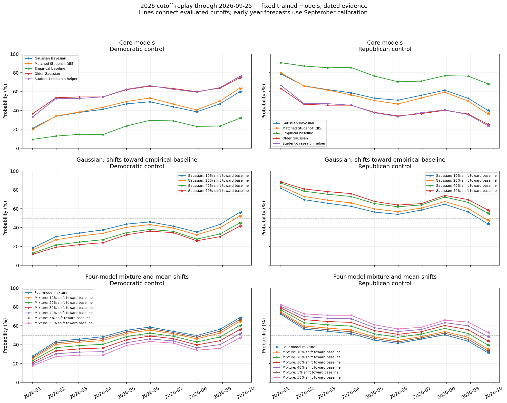

### Recent reference-model cutoffs

| Cutoff     |   D control % |   R control % |   Expected D seats |   D seats: 70% low |   D seats: 70% high |
|:-----------|--------------:|--------------:|-------------------:|-------------------:|--------------------:|
| 2026-09-23 |         59.85 |         40.15 |              50.88 |                 49 |                  52 |
| 2026-09-24 |         59.34 |         40.66 |              50.86 |                 49 |                  52 |
| 2026-09-25 |         60.17 |         39.83 |              50.89 |                 49 |                  52 |

History mode: **dated**; regular spacing: **30 days**. Small differences can include Monte Carlo variation. All models and cutoff rows are in the HTML and supporting Parquet tables.

## Comparison with published forecasts

This section is generated from publisher feeds on each live rerun. It compares the Gaussian Bayesian reference and the four-model mixture with published forecasts. A numerical mismatch means opposite favored winners or a D/Independent win probability gap of at least 15 percentage points. For ratings, a mismatch means opposite favored parties, or a publisher toss-up when our model gives one party at least 75% probability. Ratings are never converted into probabilities. These are differences of opinion, not evidence that either forecast is wrong. Sources can use different data dates and methods. Chamber totals retain each publisher’s own independent-caucus convention. Independent candidates count on the D/Independent side in state comparisons. Published D and independent win probabilities are added once; independents already in a publisher’s D column are not added again. This is our comparison assumption, not a claim about their party affiliation or future caucus. Silver supplies only a dated, rounded public Deluxe topline; its detailed subscriber forecasts are unavailable. Publisher releases after our cutoff are excluded. A successful download does not mean the forecast was updated today.

### Source dates and availability

| Source                 | URL                                                            | Status            | Published   | Retrieved                        | Error   | Coverage                                                                                                                                     |   Days before our cutoff |
|:-----------------------|:---------------------------------------------------------------|:------------------|:------------|:---------------------------------|:--------|:---------------------------------------------------------------------------------------------------------------------------------------------|-------------------------:|
| Silver Bulletin Deluxe | https://www.natesilver.net/p/expert-ratings-are-ignoring-signs | fresh_check_cache | 2026-09-20  | 2026-09-25T16:01:10.670734+00:00 |         | Rounded Deluxe Senate-control probability from public text. State probabilities and expected seats are subscriber-only and unavailable here. |                        5 |
| Race to the WH         | https://www.racetothewh.com/senate/26                          | fresh_check_cache | 2026-09-24  | 2026-09-25T16:01:11.239327+00:00 |         | State and chamber forecasts                                                                                                                  |                        1 |
| Inside Elections       | https://insideelections.com/ratings/senate/                    | fresh_check_cache | 2026-09-17  | 2026-09-25T16:01:12.973259+00:00 |         | Public race ratings                                                                                                                          |                        8 |

### Senate control and expected seats

| Forecast               | Date       |   D control % | Expected D seats   | Coverage                                                                                                                                     |
|:-----------------------|:-----------|--------------:|:-------------------|:---------------------------------------------------------------------------------------------------------------------------------------------|
| Gaussian Bayesian      | 2026-09-25 |         60.17 | 50.89134835028253  | Our model                                                                                                                                    |
| Four-model mixture     | 2026-09-25 |         68.82 | 51.37606718752925  | Our model                                                                                                                                    |
| Silver Bulletin Deluxe | 2026-09-20 |         65.00 | —                  | Rounded Deluxe Senate-control probability from public text. State probabilities and expected seats are subscriber-only and unavailable here. |
| Race to the WH         | 2026-09-24 |         70.50 | 52.5               | Published forecast.                                                                                                                          |

### Chamber differences: ours minus publisher

| Model              | Publisher              | Published   |   Our D control % |   Published D control % |   Gap (pp) | Expected-seat gap   | Comparison                                 |
|:-------------------|:-----------------------|:------------|------------------:|------------------------:|-----------:|:--------------------|:-------------------------------------------|
| Gaussian Bayesian  | Silver Bulletin Deluxe | 2026-09-20  |             60.17 |                   65.00 |      -4.83 | —                   | The models favor the same Senate majority. |
| Four-model mixture | Silver Bulletin Deluxe | 2026-09-20  |             68.82 |                   65.00 |       3.82 | —                   | The models favor the same Senate majority. |
| Gaussian Bayesian  | Race to the WH         | 2026-09-24  |             60.17 |                   70.50 |     -10.33 | -1.6086516497174728 | The models favor the same Senate majority. |
| Four-model mixture | Race to the WH         | 2026-09-24  |             68.82 |                   70.50 |      -1.68 | -1.1239328124707484 | The models favor the same Senate majority. |

### Inside Elections: favored-party counts in matched races

| Model              |   Matched races |   Our D/Independent favored |   Our R favored |   Publisher D/Independent favored |   Publisher R favored |   Publisher toss-ups |
|:-------------------|----------------:|----------------------------:|----------------:|----------------------------------:|----------------------:|---------------------:|
| Gaussian Bayesian  |              35 |                          17 |              18 |                                12 |                    19 |                    4 |
| Four-model mixture |              35 |                          17 |              18 |                                12 |                    19 |                    4 |

### State mismatches

| Source           | Published   | Model              | Contest   |   Our D/Independent win % | Published D/Independent win %   | Published rating   | Gap (pp)            | Side definition                                | Reason                                                                                         |
|:-----------------|:------------|:-------------------|:----------|--------------------------:|:--------------------------------|:-------------------|:--------------------|:-----------------------------------------------|:-----------------------------------------------------------------------------------------------|
| Inside Elections | 2026-09-17  | Four-model mixture | ME        |                     85.54 | —                               | Toss-up            | —                   | D versus R.                                    | The publisher rates this a toss-up. Our model gives D 85.5%.                                   |
| Inside Elections | 2026-09-17  | Four-model mixture | MI        |                     83.17 | —                               | Toss-up            | —                   | D versus R.                                    | The publisher rates this a toss-up. Our model gives D 83.2%.                                   |
| Inside Elections | 2026-09-17  | Four-model mixture | NH        |                     92.77 | —                               | Toss-up            | —                   | D versus R.                                    | The publisher rates this a toss-up. Our model gives D 92.8%.                                   |
| Inside Elections | 2026-09-17  | Four-model mixture | TX        |                     54.91 | —                               | Lean Republican    | —                   | D versus R.                                    | Our favored party differs from the published rating.                                           |
| Inside Elections | 2026-09-17  | Gaussian Bayesian  | ME        |                     92.55 | —                               | Toss-up            | —                   | D versus R.                                    | The publisher rates this a toss-up. Our model gives D 92.6%.                                   |
| Inside Elections | 2026-09-17  | Gaussian Bayesian  | MI        |                     83.45 | —                               | Toss-up            | —                   | D versus R.                                    | The publisher rates this a toss-up. Our model gives D 83.4%.                                   |
| Inside Elections | 2026-09-17  | Gaussian Bayesian  | NH        |                     97.93 | —                               | Toss-up            | —                   | D versus R.                                    | The publisher rates this a toss-up. Our model gives D 97.9%.                                   |
| Inside Elections | 2026-09-17  | Gaussian Bayesian  | TX        |                     56.72 | —                               | Lean Republican    | —                   | D versus R.                                    | Our favored party differs from the published rating.                                           |
| Race to the WH   | 2026-09-24  | Four-model mixture | KS        |                     10.61 | 42.8                            | —                  | -32.19385416666844  | D versus R.                                    | Our D/Independent win probability is 32.2 points lower.                                        |
| Race to the WH   | 2026-09-24  | Four-model mixture | ME        |                     85.54 | 62.2                            | —                  | 23.343645833479798  | D versus R.                                    | Our D/Independent win probability is 23.3 points higher.                                       |
| Race to the WH   | 2026-09-24  | Four-model mixture | TX        |                     54.91 | 77.2                            | —                  | -22.28661458332747  | D versus R.                                    | Our D/Independent win probability is 22.3 points lower.                                        |
| Race to the WH   | 2026-09-24  | Four-model mixture | IA        |                     36.92 | 59.0                            | —                  | -22.076614583352907 | D versus R.                                    | The forecasts favor different parties. Our D/Independent win probability is 22.1 points lower. |
| Race to the WH   | 2026-09-24  | Four-model mixture | MT        |                      2.04 | 22.2                            | —                  | -20.16229166666673  | Independents count with D for this comparison. | Our D/Independent win probability is 20.2 points lower.                                        |
| Race to the WH   | 2026-09-24  | Four-model mixture | WV        |                     19.28 | 0.7                             | —                  | 18.583541666673366  | D versus R.                                    | Our D/Independent win probability is 18.6 points higher.                                       |
| Race to the WH   | 2026-09-24  | Four-model mixture | AK        |                     39.96 | 56.60000000000001               | —                  | -16.64031250002701  | D versus R.                                    | The forecasts favor different parties. Our D/Independent win probability is 16.6 points lower. |
| Race to the WH   | 2026-09-24  | Gaussian Bayesian  | KS        |                      9.28 | 42.8                            | —                  | -33.518538891648575 | D versus R.                                    | Our D/Independent win probability is 33.5 points lower.                                        |
| Race to the WH   | 2026-09-24  | Gaussian Bayesian  | ME        |                     92.55 | 62.2                            | —                  | 30.351099504360015  | D versus R.                                    | Our D/Independent win probability is 30.4 points higher.                                       |
| Race to the WH   | 2026-09-24  | Gaussian Bayesian  | IA        |                     36.18 | 59.0                            | —                  | -22.822648422906454 | D versus R.                                    | The forecasts favor different parties. Our D/Independent win probability is 22.8 points lower. |
| Race to the WH   | 2026-09-24  | Gaussian Bayesian  | AK        |                     33.88 | 56.60000000000001               | —                  | -22.72338904881732  | D versus R.                                    | The forecasts favor different parties. Our D/Independent win probability is 22.7 points lower. |
| Race to the WH   | 2026-09-24  | Gaussian Bayesian  | TX        |                     56.72 | 77.2                            | —                  | -20.479051592507492 | D versus R.                                    | Our D/Independent win probability is 20.5 points lower.                                        |
| Race to the WH   | 2026-09-24  | Gaussian Bayesian  | MT        |                      2.95 | 22.2                            | —                  | -19.247150990580476 | Independents count with D for this comparison. | Our D/Independent win probability is 19.2 points lower.                                        |
| Race to the WH   | 2026-09-24  | Gaussian Bayesian  | SC        |                      4.70 | 20.4                            | —                  | -15.701631147404205 | D versus R.                                    | Our D/Independent win probability is 15.7 points lower.                                        |

### Excluded comparisons

No rows qualify or the source is unavailable. Check source status above.

[All matched state comparisons](published_all_states.parquet) · [Publisher snapshots and provenance](published_sources.json) · [Comparison settings](published_parameters.json)

## Shareable images

The tables above remain available. These PNGs are generated from the same saved results on every run.

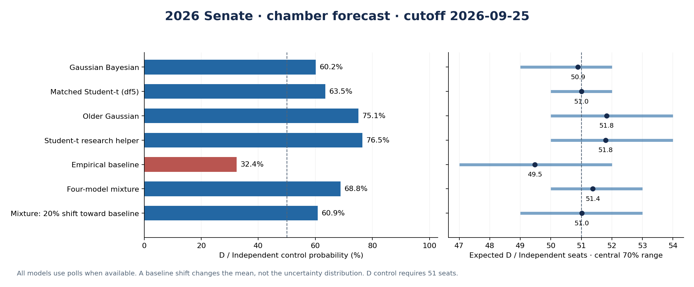

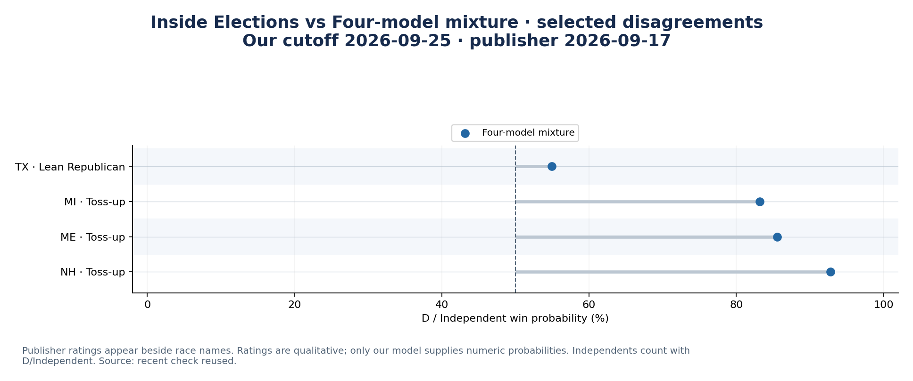

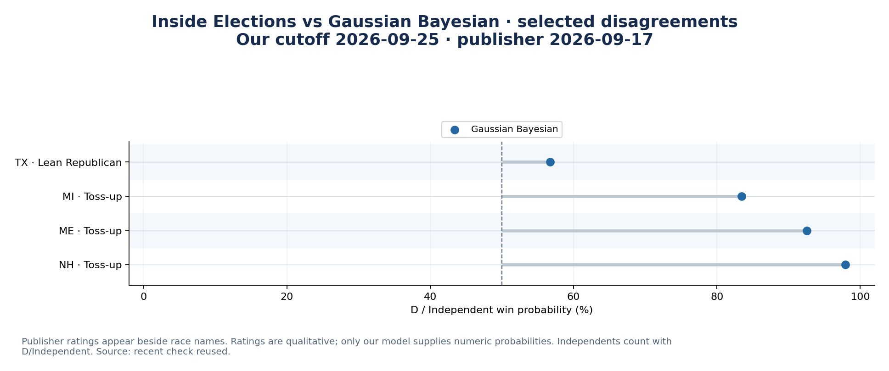

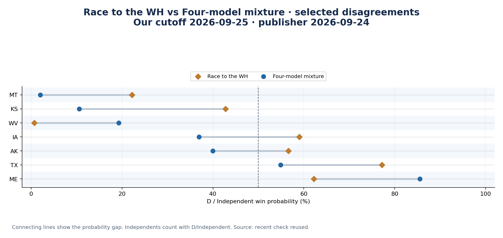

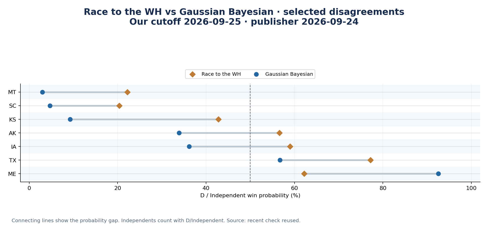

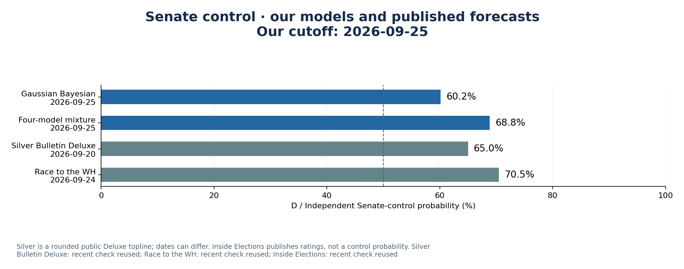

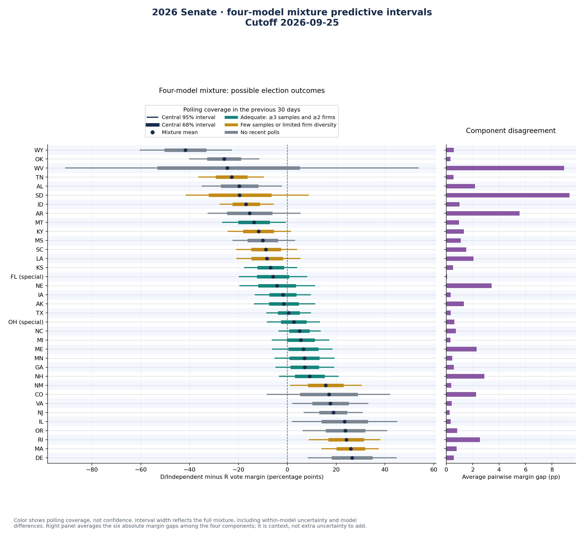

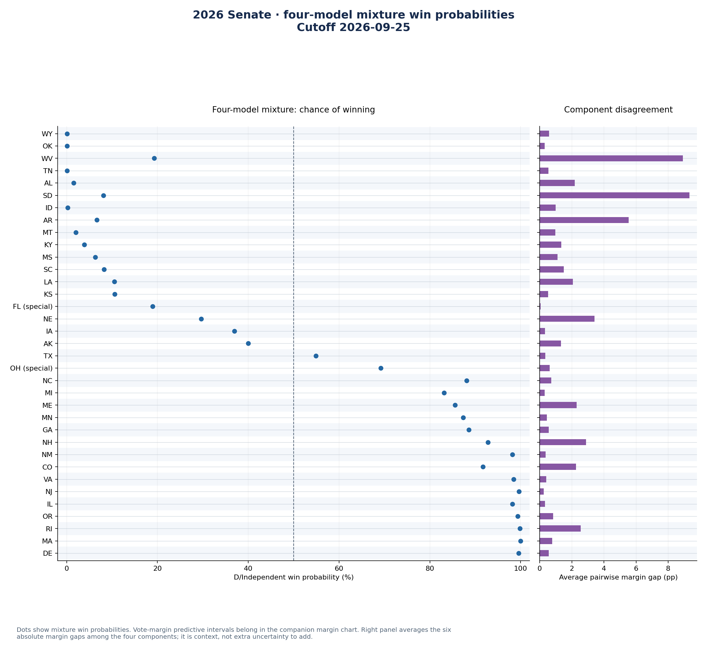

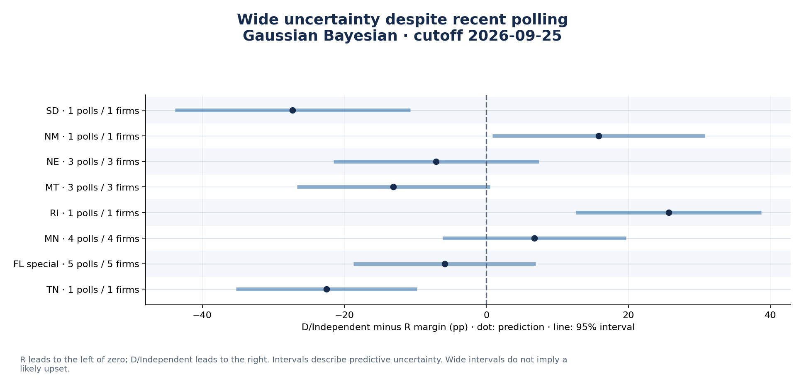

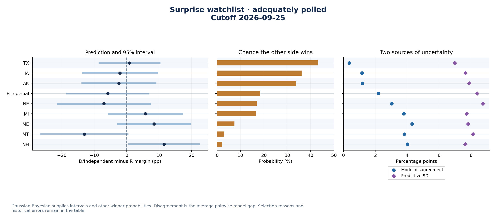

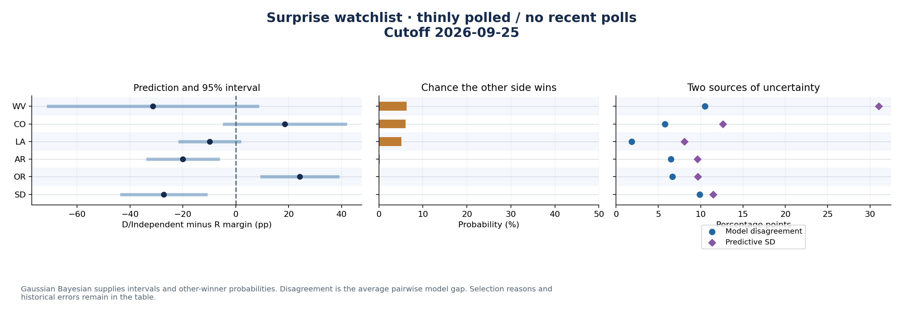

[Image manifest](share_images.json)

## Provenance and interpretation

- [Forecast settings, input hash and source receipts](forecast_metadata.json)
- [Complete state predictions](predictions.parquet)
- [Chamber results](seats.parquet)

The model retains its candidate, caucus, election-rule, historical-vintage and small-sample limitations. Probabilities are model estimates. An unchanged fitted checkpoint can produce different forecasts when polls, feature observations or the cutoff change.
