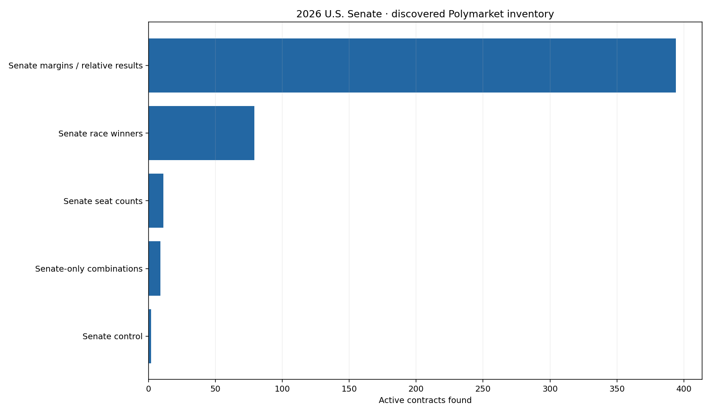
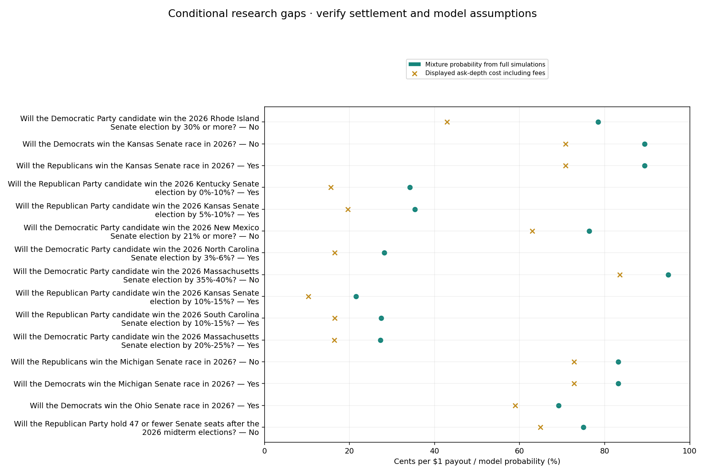

# Polymarket Senate market research

Snapshot: **2026-09-25T17:00:54.821763+00:00**. Forecast cutoff: **2026-09-25** (0 days old).

Catalog: checked online. Order books: checked online.

All pages of the listed discovery tags were scanned. Only 2026 U.S. Senate winners, margins/relative results, control, seat totals and Senate-only combinations are retained. Tag omissions or unrecognized titles can leave gaps; this is not guaranteed platform-wide coverage.

Research only; model-conditioned expected-value gaps are not arbitrage or guaranteed returns. No orders or account access.

Forecast may retain unresolved source/roster reviews. No candidate-by-candidate third-party or first-round model. Joint draws are saved, but combination/ranking settlement mappings remain unsupported. Simulation estimates have Monte Carlo error and are not confidence in model accuracy. Prices can move before execution. Repeated contracts share risk.

Forecast source review: full_online_final_poll_review

## Catalog coverage

**78 event groups; 495 active contracts.** An event groups related contracts. Each margin band is a separate contract. Yes and No are two sides of one contract and are not counted twice. These counts are not numbers of races.

| category                          |   events |   contracts |   reported_liquidity |
|:----------------------------------|---------:|------------:|---------------------:|
| Senate margins / relative results |       39 |         394 |           2953873.98 |
| Senate race winners               |       35 |          79 |           4088919.25 |
| Senate seat counts                |        1 |          11 |            332050.09 |
| Senate-only combinations          |        2 |           9 |            102902.74 |
| Senate control                    |        1 |           2 |            908714.83 |

## Conditional review candidates

Illustrative depth: 100 shares per contract. Threshold: at least 3pp modeled gap after taker fees, spread ≤0.1, reported liquidity ≥$2000. These are independent contract screens, not a portfolio or instructions to trade.

| Contract                                                                                    | Outcome   |   Model probability % |   Cost incl. fees (¢) |   Minimum modeled gap (pp) |   Bid–ask spread ($) | probability_kind                    | Settlement assumption                                                                                                | screen           | url                                                                                                                                                                                   |
|:--------------------------------------------------------------------------------------------|:----------|----------------------:|----------------------:|---------------------------:|---------------------:|:------------------------------------|:---------------------------------------------------------------------------------------------------------------------|:-----------------|:--------------------------------------------------------------------------------------------------------------------------------------------------------------------------------------|
| Will the Democrats win the Kansas Senate race in 2026?                                      | No        |                89.400 |                70.840 |                     18.554 |                0.010 | Full weighted joint simulations     | Assumes modeled D/R contenders exhaust the winning outcomes; party replacements and third-party wins require review  | Review candidate | https://polymarket.com/event/kansas-senate-election-winner/will-the-democrats-win-the-kansas-senate-race-in-2026                                                                      |
| Will the Republicans win the Kansas Senate race in 2026?                                    | Yes       |                89.400 |                70.840 |                     18.554 |                0.010 | Full weighted joint simulations     | Assumes modeled D/R contenders exhaust the winning outcomes; party replacements and third-party wins require review  | Review candidate | https://polymarket.com/event/kansas-senate-election-winner/will-the-republicans-win-the-kansas-senate-race-in-2026                                                                    |
| Will the Democratic Party candidate win the 2026 North Carolina Senate election by 3%-6%?   | Yes       |                28.200 |                16.538 |                     11.672 |                0.010 | Full weighted joint simulations     | Assumes D/R are the top two and forecast margin uses the same vote denominator; full predictive distribution is used | Review candidate | https://polymarket.com/event/north-carolina-senate-margin-of-victory-2026/will-the-democratic-party-candidate-win-the-2026-north-carolina-senate-election-by-3-6                      |
| Will the Democratic Party candidate win the 2026 Massachusetts Senate election by 35%-40%?  | No        |                94.900 |                83.564 |                     11.355 |                0.020 | Full weighted joint simulations     | Assumes D/R are the top two and forecast margin uses the same vote denominator; full predictive distribution is used | Review candidate | https://polymarket.com/event/massachusetts-senate-margin-of-victory-2026/will-the-democratic-party-candidate-win-the-2026-massachusetts-senate-election-by-35-40                      |
| Will the Republican Party candidate win the 2026 Kansas Senate election by 10%-15%?         | Yes       |                21.500 |                10.360 |                     11.144 |                0.020 | Full weighted joint simulations     | Assumes D/R are the top two and forecast margin uses the same vote denominator; full predictive distribution is used | Review candidate | https://polymarket.com/event/kansas-senate-margin-of-victory-2026/will-the-republican-party-candidate-win-the-2026-kansas-senate-election-by-10-15                                    |
| Will the Republican Party candidate win the 2026 South Carolina Senate election by 10%-15%? | Yes       |                27.500 |                16.538 |                     10.916 |                0.010 | Full weighted joint simulations     | Assumes D/R are the top two and forecast margin uses the same vote denominator; full predictive distribution is used | Review candidate | https://polymarket.com/event/south-carolina-senate-margin-of-victory-2026/will-the-republican-party-candidate-win-the-2026-south-carolina-senate-election-by-10-15                    |
| Will the Democratic Party candidate win the 2026 Massachusetts Senate election by 20%-25%?  | Yes       |                27.200 |                16.399 |                     10.832 |                0.040 | Full weighted joint simulations     | Assumes D/R are the top two and forecast margin uses the same vote denominator; full predictive distribution is used | Review candidate | https://polymarket.com/event/massachusetts-senate-margin-of-victory-2026/will-the-democratic-party-candidate-win-the-2026-massachusetts-senate-election-by-20-25                      |
| Will the Republicans win the Michigan Senate race in 2026?                                  | No        |                83.200 |                72.806 |                     10.360 |                0.010 | Full weighted joint simulations     | Assumes modeled D/R contenders exhaust the winning outcomes; party replacements and third-party wins require review  | Review candidate | https://polymarket.com/event/michigan-senate-election-winner/will-the-republicans-win-the-michigan-senate-race-in-2026                                                                |
| Will the Democrats win the Michigan Senate race in 2026?                                    | Yes       |                83.200 |                72.806 |                     10.360 |                0.010 | Full weighted joint simulations     | Assumes modeled D/R contenders exhaust the winning outcomes; party replacements and third-party wins require review  | Review candidate | https://polymarket.com/event/michigan-senate-election-winner/will-the-democrats-win-the-michigan-senate-race-in-2026                                                                  |
| Will the Democrats win the Ohio Senate race in 2026?                                        | Yes       |                69.200 |                58.974 |                     10.208 |                0.010 | Full weighted joint simulations     | Assumes modeled D/R contenders exhaust the winning outcomes; party replacements and third-party wins require review  | Review candidate | https://polymarket.com/event/ohio-senate-election-winner/will-the-democrats-win-the-ohio-senate-race-in-2026                                                                          |
| Will the Republican Party hold 47 or fewer Senate seats after the 2026 midterm elections?   | No        |                75.000 |                64.922 |                     10.044 |                0.010 | Saved model seat-count distribution | Assumes R seats equal 100 minus modeled D/Independent seats; caucus choices and vacancies may differ from contract   | Review candidate | https://polymarket.com/event/republican-senate-seats-after-the-2026-midterm-elections-927/will-the-republican-party-hold-47-or-fewer-senate-seats-after-the-2026-midterm-elections    |
| Will the Democrats win the Florida Senate race in 2026?                                     | Yes       |                18.900 |                 9.328 |                      9.594 |                0.010 | Full weighted joint simulations     | Assumes modeled D/R contenders exhaust the winning outcomes; party replacements and third-party wins require review  | Review candidate | https://polymarket.com/event/florida-senate-election-winner/will-the-democrats-win-the-florida-senate-race-in-2026                                                                    |
| Will the Republicans win the Florida Senate race in 2026?                                   | No        |                18.900 |                 9.328 |                      9.594 |                0.010 | Full weighted joint simulations     | Assumes modeled D/R contenders exhaust the winning outcomes; party replacements and third-party wins require review  | Review candidate | https://polymarket.com/event/florida-senate-election-winner/will-the-republicans-win-the-florida-senate-race-in-2026                                                                  |
| Will the Democratic Party candidate win the 2026 Virginia Senate election by 18%-21%?       | No        |                84.400 |                75.400 |                      9.015 |                0.010 | Full weighted joint simulations     | Assumes D/R are the top two and forecast margin uses the same vote denominator; full predictive distribution is used | Review candidate | https://polymarket.com/event/virginia-senate-margin-of-victory-2026/will-the-democratic-party-candidate-win-the-2026-virginia-senate-election-by-18-21                                |
| Will the Democratic Party candidate win the 2026 Massachusetts Senate election by 15%-20%?  | Yes       |                11.700 |                 2.909 |                      8.839 |                0.008 | Full weighted joint simulations     | Assumes D/R are the top two and forecast margin uses the same vote denominator; full predictive distribution is used | Review candidate | https://polymarket.com/event/massachusetts-senate-margin-of-victory-2026/will-the-democratic-party-candidate-win-the-2026-massachusetts-senate-election-by-15-20                      |
| Will the Republican Party candidate win the 2026 Kentucky Senate election by 20%-25%?       | No        |                92.200 |                83.564 |                      8.670 |                0.040 | Full weighted joint simulations     | Assumes D/R are the top two and forecast margin uses the same vote denominator; full predictive distribution is used | Review candidate | https://polymarket.com/event/kentucky-senate-margin-of-victory-2026/will-the-republican-party-candidate-win-the-2026-kentucky-senate-election-by-20-25                                |
| Will the Republican Party candidate win the 2026 Kentucky Senate election by 10%-15%?       | Yes       |                31.000 |                22.686 |                      8.360 |                0.040 | Full weighted joint simulations     | Assumes D/R are the top two and forecast margin uses the same vote denominator; full predictive distribution is used | Review candidate | https://polymarket.com/event/kentucky-senate-margin-of-victory-2026/will-the-republican-party-candidate-win-the-2026-kentucky-senate-election-by-10-15                                |
| Will the Republican Party hold exactly 49 Senate seats after the 2026 midterm elections?    | Yes       |                22.800 |                14.482 |                      8.294 |                0.010 | Saved model seat-count distribution | Assumes R seats equal 100 minus modeled D/Independent seats; caucus choices and vacancies may differ from contract   | Review candidate | https://polymarket.com/event/republican-senate-seats-after-the-2026-midterm-elections-927/will-the-republican-party-hold-exactly-49-senate-seats-after-the-2026-midterm-elections-189 |
| Will the Republicans win the Ohio Senate race in 2026?                                      | No        |                69.200 |                60.960 |                      8.222 |                0.010 | Full weighted joint simulations     | Assumes modeled D/R contenders exhaust the winning outcomes; party replacements and third-party wins require review  | Review candidate | https://polymarket.com/event/ohio-senate-election-winner/will-the-republicans-win-the-ohio-senate-race-in-2026                                                                        |
| Will the Democratic Party candidate win the 2026 New Mexico Senate election by 18%-21%?     | No        |                85.700 |                77.708 |                      8.006 |                0.020 | Full weighted joint simulations     | Assumes D/R are the top two and forecast margin uses the same vote denominator; full predictive distribution is used | Review candidate | https://polymarket.com/event/new-mexico-senate-margin-of-victory-2026/will-the-democratic-party-candidate-win-the-2026-new-mexico-senate-election-by-18-21                            |
| Will the Democratic Party candidate win the 2026 Massachusetts Senate election by 40%-45%?  | No        |                99.200 |                91.328 |                      7.867 |                0.040 | Full weighted joint simulations     | Assumes D/R are the top two and forecast margin uses the same vote denominator; full predictive distribution is used | Review candidate | https://polymarket.com/event/massachusetts-senate-margin-of-victory-2026/will-the-democratic-party-candidate-win-the-2026-massachusetts-senate-election-by-40-45                      |
| Will the Democratic Party candidate win the 2026 Rhode Island Senate election by 20%-25%?   | Yes       |                25.300 |                17.462 |                      7.857 |                0.058 | Full weighted joint simulations     | Assumes D/R are the top two and forecast margin uses the same vote denominator; full predictive distribution is used | Review candidate | https://polymarket.com/event/rhode-island-senate-margin-of-victory-2026/will-the-democratic-party-candidate-win-the-2026-rhode-island-senate-election-by-20-25                        |
| Will the Democratic Party candidate win the 2026 Rhode Island Senate election by 15%-20%?   | Yes       |                16.600 |                 9.179 |                      7.468 |                0.019 | Full weighted joint simulations     | Assumes D/R are the top two and forecast margin uses the same vote denominator; full predictive distribution is used | Review candidate | https://polymarket.com/event/rhode-island-senate-margin-of-victory-2026/will-the-democratic-party-candidate-win-the-2026-rhode-island-senate-election-by-15-20                        |
| Will the Republican Party candidate win the 2026 Arkansas Senate election by 10%-15%?       | No        |                82.000 |                74.573 |                      7.440 |                0.003 | Full weighted joint simulations     | Assumes D/R are the top two and forecast margin uses the same vote denominator; full predictive distribution is used | Review candidate | https://polymarket.com/event/arkansas-senate-margin-of-victory-2026/will-the-republican-party-candidate-win-the-2026-arkansas-senate-election-by-10-15                                |
| Will the Republican Party candidate win the 2026 Arkansas Senate election by 20%-25%?       | Yes       |                18.800 |                11.392 |                      7.398 |                0.020 | Full weighted joint simulations     | Assumes D/R are the top two and forecast margin uses the same vote denominator; full predictive distribution is used | Review candidate | https://polymarket.com/event/arkansas-senate-margin-of-victory-2026/will-the-republican-party-candidate-win-the-2026-arkansas-senate-election-by-20-25                                |

## How to interpret margins and missing comparisons

Margin probabilities use full saved predictive simulations. Gaussian model state events use an analytic CDF. Simulation estimates have Monte Carlo error. Top-two candidate, vote denominator, first-round, third-party and caucus rules must match before treating a gap as comparable. House, governor, turnout, county, primary and price-target contracts are excluded. Senate-only combinations remain inventoried but unpriced until their joint settlement conditions have a supported mapping. Do not multiply marginal state probabilities for correlated combination markets.

## Downloads

[Full event inventory](events.parquet) · [All contracts](inventory.parquet) · [All comparisons and exclusion reasons](comparisons.parquet) · [Source metadata and rules](catalog.json.gz) · [Order-book snapshot](order_books.json.gz) · [Run settings](status.json)

## All discovered events

### Senate control

- [Which party will win the Senate in 2026?](https://polymarket.com/event/which-party-will-win-the-senate-in-2026)

### Senate margins / relative results

- [Alabama Senate Election Margin of Victory](https://polymarket.com/event/alabama-senate-margin-of-victory-2026)
- [Alaska Senate Election Margin of Victory (First Round)](https://polymarket.com/event/alaska-senate-election-margin-of-victory-first-round)
- [Arkansas Senate Election Margin of Victory](https://polymarket.com/event/arkansas-senate-margin-of-victory-2026)
- [Closest Senate Race?](https://polymarket.com/event/closest-senate-race-20260626184244519)
- [Colorado Senate Election Margin of Victory](https://polymarket.com/event/colorado-senate-margin-of-victory-2026)
- [Delaware Senate Election Margin of Victory](https://polymarket.com/event/delaware-senate-margin-of-victory-2026)
- [Dems' best tossup Senate race?](https://polymarket.com/event/dems-best-tossup-senate-race)
- [Florida Senate Election Margin of Victory](https://polymarket.com/event/florida-senate-margin-of-victory-2026)
- [Georgia Senate Election Margin of Victory (First Round)](https://polymarket.com/event/georgia-senate-election-first-round-margin-of-victory-20260804175717495)
- [Idaho Senate Election Margin of Victory](https://polymarket.com/event/idaho-senate-margin-of-victory-2026)
- [Illinois Senate Election Margin of Victory](https://polymarket.com/event/illinois-senate-margin-of-victory-2026)
- [Iowa Senate Election Margin of Victory](https://polymarket.com/event/iowa-senate-margin-of-victory-2026)
- [Kansas Senate Election Margin of Victory](https://polymarket.com/event/kansas-senate-margin-of-victory-2026)
- [Kentucky Senate Election Margin of Victory](https://polymarket.com/event/kentucky-senate-margin-of-victory-2026)
- [Louisiana Senate Election Margin of Victory](https://polymarket.com/event/louisiana-senate-margin-of-victory-2026)
- [Maine Senate Election Margin of Victory (First Round)](https://polymarket.com/event/maine-senate-election-margin-of-victory-first-round-20260804181547915)
- [Massachusetts Senate Election Margin of Victory](https://polymarket.com/event/massachusetts-senate-margin-of-victory-2026)
- [Michigan Senate Election Margin of Victory](https://polymarket.com/event/michigan-senate-margin-of-victory-2026)
- [Minnesota Senate Election Margin of Victory](https://polymarket.com/event/minnesota-senate-margin-of-victory-2026)
- [Mississippi Senate Election Margin of Victory (First Round)](https://polymarket.com/event/mississippi-senate-election-margin-of-victory-first-round-20260804182229477)
- [Montana Senate Election Margin of Victory](https://polymarket.com/event/montana-senate-margin-of-victory-2026)
- [Nebraska Senate Election Margin of Victory](https://polymarket.com/event/nebraska-senate-margin-of-victory-2026)
- [New Hampshire Senate Election Margin of Victory](https://polymarket.com/event/new-hampshire-senate-margin-of-victory-2026)
- [New Jersey Senate Election Margin of Victory](https://polymarket.com/event/new-jersey-senate-margin-of-victory-2026)
- [New Mexico Senate Election Margin of Victory](https://polymarket.com/event/new-mexico-senate-margin-of-victory-2026)
- [North Carolina Senate Election Margin of Victory](https://polymarket.com/event/north-carolina-senate-margin-of-victory-2026)
- [Ohio Senate Election Margin of Victory](https://polymarket.com/event/ohio-senate-margin-of-victory-2026)
- [Oklahoma Senate Election Margin of Victory](https://polymarket.com/event/oklahoma-senate-margin-of-victory-2026)
- [Oregon Senate Election Margin of Victory](https://polymarket.com/event/oregon-senate-margin-of-victory-2026)
- [Rhode Island Senate Election Margin of Victory](https://polymarket.com/event/rhode-island-senate-margin-of-victory-2026)
- [South Carolina Senate Election Margin of Victory](https://polymarket.com/event/south-carolina-senate-margin-of-victory-2026)
- [South Dakota Senate Election Margin of Victory](https://polymarket.com/event/south-dakota-senate-margin-of-victory-2026)
- [Tennessee Senate Election Margin of Victory](https://polymarket.com/event/tennessee-senate-margin-of-victory-2026)
- [Texas Senate Election Margin of Victory](https://polymarket.com/event/texas-senate-margin-of-victory-2026)
- [Virginia Senate Election Margin of Victory](https://polymarket.com/event/virginia-senate-margin-of-victory-2026)
- [West Virginia Senate Election Margin of Victory](https://polymarket.com/event/west-virginia-senate-margin-of-victory-2026)
- [Which Senate races will be within 1%?](https://polymarket.com/event/which-senate-races-will-be-within-1)
- [Which Senate races will be within 5%?](https://polymarket.com/event/which-senate-races-will-be-within-5-20260727153827321)
- [Wyoming Senate Election Margin of Victory](https://polymarket.com/event/wyoming-senate-margin-of-victory-2026)

### Senate race winners

- [Alabama Senate Election Winner](https://polymarket.com/event/alabama-senate-election-winner-154)
- [Alaska Senate Election Winner](https://polymarket.com/event/alaska-senate-election-winner)
- [Arkansas Senate Election Winner](https://polymarket.com/event/arkansas-senate-election-winner)
- [Colorado Senate Election Winner](https://polymarket.com/event/colorado-senate-election-winner)
- [Delaware Senate Election Winner](https://polymarket.com/event/delaware-senate-election-winner)
- [Florida Senate Election Winner](https://polymarket.com/event/florida-senate-election-winner)
- [Georgia Senate Election Winner](https://polymarket.com/event/georgia-senate-election-winner)
- [Idaho Senate Election Winner](https://polymarket.com/event/idaho-senate-election-winner)
- [Illinois Senate Election Winner](https://polymarket.com/event/illinois-senate-election-winner)
- [Iowa Senate Election Winner](https://polymarket.com/event/iowa-senate-election-winner)
- [Kansas Senate Election Winner](https://polymarket.com/event/kansas-senate-election-winner)
- [Kentucky Senate Election Winner](https://polymarket.com/event/kentucky-senate-election-winner)
- [Louisiana Senate Election Winner](https://polymarket.com/event/louisiana-senate-election-winner)
- [Maine Senate Election Winner](https://polymarket.com/event/maine-senate-election-winner)
- [Massachusetts Senate Election Winner](https://polymarket.com/event/massachusetts-senate-election-winner)
- [Michigan Senate Election Winner](https://polymarket.com/event/michigan-senate-election-winner)
- [Minnesota Senate Election Winner](https://polymarket.com/event/minnesota-senate-election-winner)
- [Mississippi Senate Election Winner](https://polymarket.com/event/mississippi-senate-election-winner)
- [Montana Senate Election Winner](https://polymarket.com/event/montana-senate-election-winner)
- [Nebraska Senate Election Winner  ](https://polymarket.com/event/nebraska-senate-election-winner)
- [New Hampshire Senate Election Winner](https://polymarket.com/event/new-hampshire-senate-election-winner)
- [New Jersey Senate Election Winner](https://polymarket.com/event/new-jersey-senate-election-winner)
- [New Mexico Senate Election Winner](https://polymarket.com/event/new-mexico-senate-election-winner)
- [North Carolina Senate Election Winner](https://polymarket.com/event/north-carolina-senate-election-winner)
- [Ohio Senate Election Winner](https://polymarket.com/event/ohio-senate-election-winner)
- [Oklahoma Senate Election Winner](https://polymarket.com/event/oklahoma-senate-election-winner)
- [Oregon Senate Election Winner](https://polymarket.com/event/oregon-senate-election-winner)
- [Rhode Island Senate Election Winner](https://polymarket.com/event/rhode-island-senate-election-winner)
- [South Carolina Senate Election Winner](https://polymarket.com/event/south-carolina-senate-election-winner)
- [South Dakota Senate Election Winner](https://polymarket.com/event/south-dakota-senate-election-winner)
- [Tennessee Senate Election Winner](https://polymarket.com/event/tennessee-senate-election-winner)
- [Texas Senate Election Winner](https://polymarket.com/event/texas-senate-election-winner)
- [Virginia Senate Election Winner](https://polymarket.com/event/virginia-senate-election-winner)
- [West Virginia Senate Election Winner](https://polymarket.com/event/west-virginia-senate-election-winner)
- [Wyoming Senate Election Winner](https://polymarket.com/event/wyoming-senate-election-winner)

### Senate seat counts

- [Republican Senate seats after the 2026 midterm elections?](https://polymarket.com/event/republican-senate-seats-after-the-2026-midterm-elections-927)

### Senate-only combinations

- [Senate Three-Way Combo: Texas, Michigan, Maine](https://polymarket.com/event/senate-three-way-combo-texas-michigan-maine)
- [Will Democrats win all "core four" senate races?](https://polymarket.com/event/will-democrats-win-all-core-four-senate-races)

## All model-market pairs grouped by market

152 markets. All models and both sides appear together in five-column tables.

[Colored grouped tables](scanner_grouped.html) · [Markdown tables and model legend](scanner_initial.md) · [Full numeric detail](scanner_grouped.parquet) · [Coverage audit](scanner_audit.parquet)

Extra-friction pair scenario: 0 snapshot candidates.

[Extra-friction pair checks](price_checks_stress.parquet)

## Model-free Yes/No price checks

This check buys equal quantities of Yes and No on the same binary contract. Their combined settlement payout is $1 per pair under normal settlement. A snapshot mismatch exists only when ask-depth costs, taker fees and friction on BOTH legs total less than $1. This does not use an election model. It is not an executable guarantee: both legs must fill, quotes can change, and settlement/platform risk remains. Other relationships, such as winner versus margin bands or seat totals versus control, are not tested without verified matching settlement rules.

Snapshot candidates: 0.

| Contract                                                                                   |   Shares on each side |   Cost of both sides ($) |   Normal combined payout ($) |   Snapshot payoff less cost ($) | Status                           | Explanation                                                                                  |
|:-------------------------------------------------------------------------------------------|----------------------:|-------------------------:|-----------------------------:|--------------------------------:|:---------------------------------|:---------------------------------------------------------------------------------------------|
| Will the Democrats win the South Dakota Senate race in 2026?                               |                   100 |                   100.11 |                          100 |                           -0.11 | No positive mismatch after costs | Combined purchase cost is at least the normal settlement payout.                             |
| Will the Democratic Party candidate win the 2026 Rhode Island Senate election by 5%-10%?   |                   100 |                   100.12 |                          100 |                           -0.12 | Blocked                          | Yes: book timestamp is stale or in the future. No: book timestamp is stale or in the future. |
| Will the Democratic Party candidate win the 2026 Virginia Senate election by 0%-3%?        |                   100 |                   100.17 |                          100 |                           -0.17 | No positive mismatch after costs | Combined purchase cost is at least the normal settlement payout.                             |
| Will the Republican Party hold exactly 56 Senate seats after the 2026 midterm elections?   |                   100 |                   100.22 |                          100 |                           -0.22 | No positive mismatch after costs | Combined purchase cost is at least the normal settlement payout.                             |
| Will the Republicans win the Wyoming Senate race in 2026?                                  |                   100 |                   100.34 |                          100 |                           -0.34 | No positive mismatch after costs | Combined purchase cost is at least the normal settlement payout.                             |
| Will the Republican Party hold 57 or more Senate seats after the 2026 midterm elections?   |                   100 |                   100.34 |                          100 |                           -0.34 | No positive mismatch after costs | Combined purchase cost is at least the normal settlement payout.                             |
| Will the Democratic Party candidate win the 2026 Virginia Senate election by 3%-6%?        |                   100 |                   100.38 |                          100 |                           -0.38 | No positive mismatch after costs | Combined purchase cost is at least the normal settlement payout.                             |
| Will the Democratic Party candidate win the 2026 Idaho Senate election?                    |                   100 |                   100.39 |                          100 |                           -0.39 | No positive mismatch after costs | Combined purchase cost is at least the normal settlement payout.                             |
| Will the Democrats win the Montana Senate race in 2026?                                    |                   100 |                   100.43 |                          100 |                           -0.43 | No positive mismatch after costs | Combined purchase cost is at least the normal settlement payout.                             |
| Will the Democratic Party candidate win the 2026 Massachusetts Senate election by 0%-10%?  |                   100 |                   100.46 |                          100 |                           -0.46 | No positive mismatch after costs | Combined purchase cost is at least the normal settlement payout.                             |
| Will the Republican Party candidate win the 2026 West Virginia Senate election by 45%-50%? |                   100 |                   100.50 |                          100 |                           -0.50 | Blocked                          | Yes: book timestamp is stale or in the future. No: book timestamp is stale or in the future. |
| Will the Democratic Party candidate win the 2026 Texas Senate election by 9%-12%?          |                   100 |                   100.52 |                          100 |                           -0.52 | No positive mismatch after costs | Combined purchase cost is at least the normal settlement payout.                             |
| Will the New Mexico 2026 Senate race be within 1%?                                         |                   100 |                   100.53 |                          100 |                           -0.53 | Blocked                          | Yes: book timestamp is stale or in the future. No: book timestamp is stale or in the future. |
| Will the Republican Party candidate win the 2026 Virginia Senate election by 3% or more?   |                   100 |                   100.54 |                          100 |                           -0.54 | No positive mismatch after costs | Combined purchase cost is at least the normal settlement payout.                             |
| Will the Democrats win the Oklahoma Senate race in 2026?                                   |                   100 |                   100.57 |                          100 |                           -0.57 | No positive mismatch after costs | Combined purchase cost is at least the normal settlement payout.                             |
| Will the Republican Party candidate win the 2026 Rhode Island Senate election?             |                   100 |                   100.71 |                          100 |                           -0.71 | No positive mismatch after costs | Combined purchase cost is at least the normal settlement payout.                             |
| Will North Carolina have the closest Senate race in 2026?                                  |                   100 |                   100.76 |                          100 |                           -0.76 | No positive mismatch after costs | Combined purchase cost is at least the normal settlement payout.                             |
| Will the Republicans win the Oregon Senate race in 2026?                                   |                   100 |                   100.76 |                          100 |                           -0.76 | No positive mismatch after costs | Combined purchase cost is at least the normal settlement payout.                             |
| Will Colorado have the closest Senate race in 2026?                                        |                   100 |                   100.81 |                          100 |                           -0.81 | No positive mismatch after costs | Combined purchase cost is at least the normal settlement payout.                             |
| Will the Democratic Party candidate win the 2026 Massachusetts Senate election by 10%-15%? |                   100 |                   100.83 |                          100 |                           -0.83 | No positive mismatch after costs | Combined purchase cost is at least the normal settlement payout.                             |

[All same-contract price checks](price_checks.parquet)

## Figures

## Probability formulas

The code maps supported contract types to explicit events. It does not hardcode a probability for each market.

| Contract | Yes probability |
|---|---|
| Democratic winner | P(D minus R margin > 0) |
| Republican winner | 1 minus P(D minus R margin > 0) |
| Democratic margin from a to b | P(a <= margin < b) |
| Republican margin from a to b | P(-b < margin <= -a) |
| Democratic Senate control | P(D/Independent seats >= 51) |
| Republican Senate control | P(D/Independent seats <= 50) |
| Republican seat total | Sum of saved seat probabilities satisfying the stated exact/at-least/at-most condition |
| Buy No | 1 minus the corresponding Yes probability |

Gaussian state events use its analytic CDF. Student-t and mixture state events count matching full simulations, with saved component weights for mixtures. Chamber events use saved joint seat frequencies, preserving state dependence. Simulation estimates have Monte Carlo error; zero observed events does not prove impossibility. No quantile interpolation or Gaussian approximation of the Student-t/mixture is used. Unrecognized or incompatible settlement rules remain unpriced.

## Sources

- [discovery](https://docs.polymarket.com/market-data/discover-markets)
- [books](https://docs.polymarket.com/market-data/prices-order-books)
- [fees](https://docs.polymarket.com/trading/fees)
